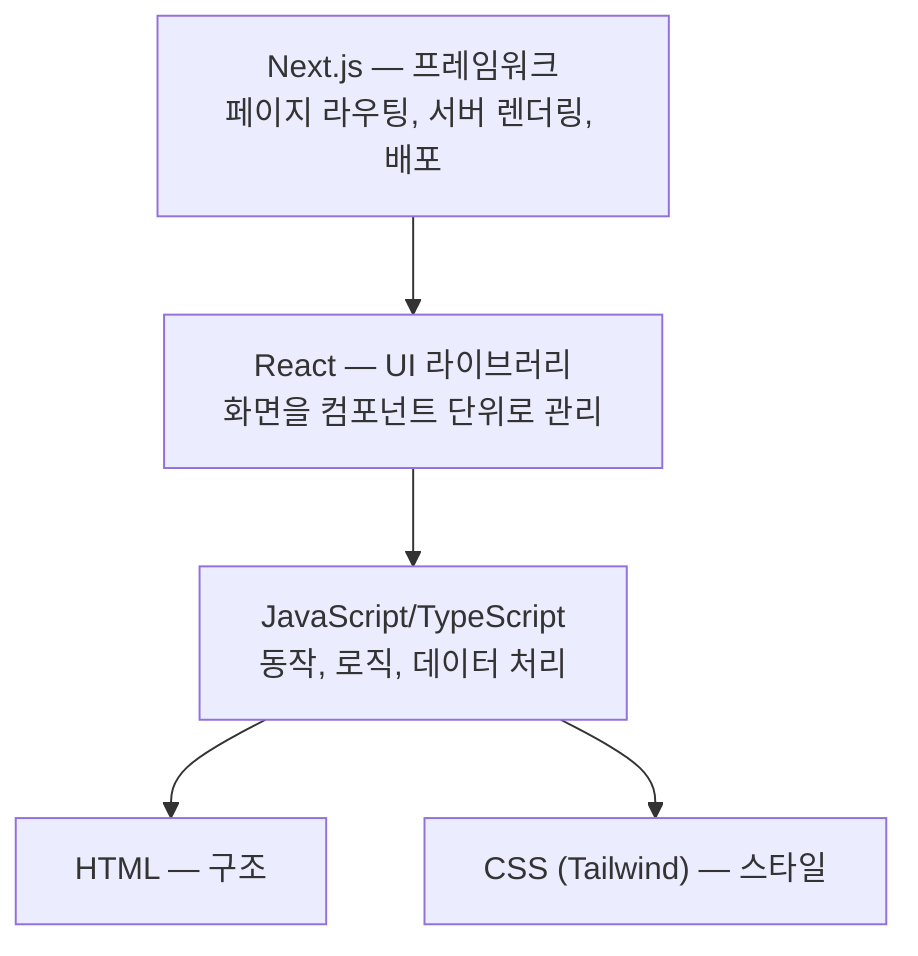
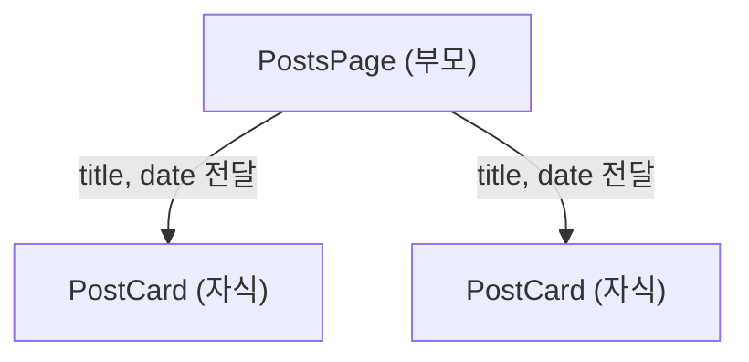
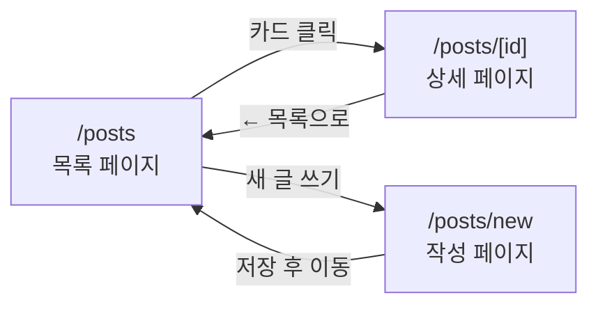
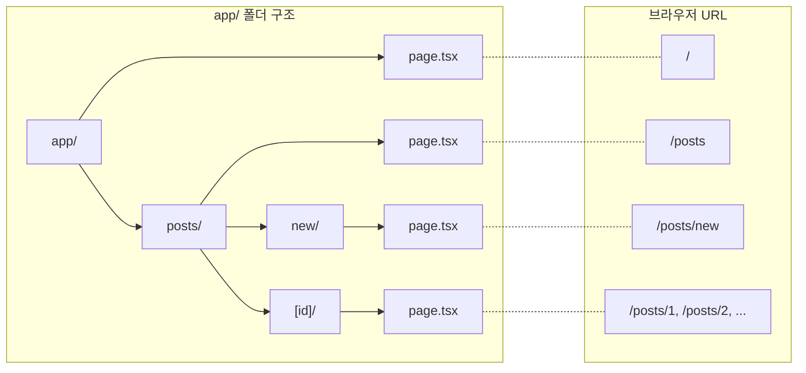

> **미션**: 블로그에 목록·상세·작성 3개 페이지를 구현하고 배포한다
> 

---

## 학습목표

1. Next.js App Router의 파일 기반 라우팅 구조를 설명할 수 있다
2. 동적 라우트(`[id]`)와 `await params` 패턴을 이해할 수 있다
3. Link 컴포넌트와 useRouter의 차이를 구분할 수 있다
4. AI가 생성한 라우팅 코드에서 흔한 실수를 발견할 수 있다

---

## 🤖 출발점 맞추기: ask가 아니라 agent로 되어 있는지 항상 체크

Ch3~Ch4를 거치며 각자 다른 화면을 가지고 있다. Ch5부터는 **동일한 출발점**에서 시작해야 같은 코드로 실습할 수 있다.

Copilot Chat(Agent 모드)에 아래 프롬프트를 입력한다:

터미널 - 새터미널 - npm run dev
`http://localhost:3000` 클릭

> "현재 my-first-web 폴더에 app 폴더가 구성되어 있다. 이 프로젝트를 아래의 조건으로 변경해줘: 기존의 파일들을 교체해야한다.
> 
> 1. app/page.tsx — 블로그 메인 페이지. '내 블로그'라는 제목과 간단한 소개 문구만 표시. Tailwind CSS 스타일링.
> 2. app/layout.tsx — 기본 레이아웃. html lang='ko', body 안에 nav(bg-gray-800, 흰색 텍스트, '내 블로그' 텍스트만), main(max-w-4xl mx-auto p-6으로 {children} 감싸기), footer(© 2026 내 블로그, 가운데 정렬, 회색). 아직 Link 컴포넌트 사용하지 말고 일반 텍스트로.
> 3. app/globals.css — @import 'tailwindcss' 한 줄만. 다른 스타일 모두 삭제.
> 4. 기존에 다른 페이지 폴더(about, contact 등)가 있으면 삭제하지 말고 그대로 둬.
> 
> Next.js 16 App Router, Tailwind CSS 4, TypeScript."
> 

### 확인

- [ ]  `http://localhost:3000`에 접속하면 내비게이션 바 + "내 블로그" 메인 + 푸터가 보이는가?
- [ ]  아래와 비슷한 화면인가?

```
┌─────────────────────────────────┐
│ ██ 내 블로그 ██                   │  ← nav
├─────────────────────────────────┤
│                                 │
│  내 블로그                        │
│  웹 개발을 배우며 기록하는 공간        │
│                                 │
├─────────────────────────────────┤
│      © 2026 내 블로그             │  ← footer
└─────────────────────────────────┘
```

> 화면이 다르더라도 **nav-main-footer 3단 구조**가 보이면 OK. 이후 실습에서 점차 채워나간다.
> 

---

## 0. React와 Next.js 기초

### 먼저 큰 그림 보기

Ch3에서 HTML/CSS로 화면의 구조와 모양을 만들었고, Ch4에서 JavaScript로 동작을 배웠다. 이번 장부터는 **React와 Next.js 위에서** 실제 여러 페이지를 가진 앱을 만든다.



### 컴포넌트란

React의 핵심 아이디어: **함수가 화면을 돌려주면 컴포넌트**이다.

```tsx
function PostCard() {
  return (
    <div className="p-4 border rounded-lg">
      <h2 className="text-lg font-bold">게시글 제목</h2>
      <p className="text-gray-600">게시글 내용...</p>
    </div>
  );
}
```

> **렌더링 결과**:
> 
> 
> ```
> ┌─────────────────────────┐
> │ 게시글 제목              │
> │ 게시글 내용...           │
> └─────────────────────────┘
> ```
> 

레고 블록처럼 작은 컴포넌트를 조립하여 화면을 구성한다.

### Props — 부모가 자식에게 데이터 전달

**Props**는 컴포넌트에 데이터를 넘겨주는 방법이다. 함수의 매개변수와 같다.

```tsx
// PostsPage — 부모 컴포넌트 (카드 여러 개를 조립한다)
function PostsPage() {
  return (
    <div>
      <h1 className="text-2xl font-bold mb-4">블로그</h1>
      <PostCard title="첫 번째 글" date="2026-03-01" />
      <PostCard title="두 번째 글" date="2026-03-05" />
    </div>
  );
}

// PostCard — 자식 컴포넌트 (카드 1개를 그린다)
function PostCard({ title, date }: { title: string; date: string }) {
  return (
    <div className="p-4 border rounded-lg">
      <h2 className="font-bold">{title}</h2>
      <p className="text-sm text-gray-500">{date}</p>
    </div>
  );
}
```

> **렌더링 결과**:
> 
> 
> ```
> ┌─────────────────────────┐
> │ 블로그                   │
> │                         │
> │ ┌─────────────────────┐ │
> │ │ 첫 번째 글           │ │
> │ │ 2026-03-01          │ │
> │ └─────────────────────┘ │
> │ ┌─────────────────────┐ │
> │ │ 두 번째 글           │ │
> │ │ 2026-03-05          │ │
> │ └─────────────────────┘ │
> └─────────────────────────┘
> ```
> 

`{ title: string; date: string }` 부분은 TypeScript 타입 표기이다. AI가 자동으로 생성해주므로, "이 컴포넌트가 어떤 데이터를 받는지 명시한 것"으로 이해하면 충분하다.

부모(`PostsPage`)가 자식(`PostCard`)에게 데이터를 넘겨주는 구조:



---

## 실습 전 준비

- [ ]  프로젝트 폴더가 VS Code에서 열려 있는가?
- [ ]  터미널에서 `npm run dev`를 실행했는가?
- [ ]  브라우저에서 `http://localhost:3000`이 열리는가?
- [ ]  위 "출발점 맞추기"를 완료했는가?

---

## 이번 실습의 완성 목표

3개 페이지를 만들고 내비게이션으로 연결한다:

```
┌─────────────────────────────────────────┐
│ ██ 내 블로그 | 홈 | 블로그 | 새 글 ██   │
├─────────────────────────────────────────┤
│                                         │
│  /posts (목록)     /posts/1 (상세)       │
│  ┌────────┐        ┌────────────────┐   │
│  │ 글 1   │───────>│ React 19 정리  │   │
│  │ 글 2   │        │ 김코딩 · 03-30 │   │
│  │ 글 3   │<───────│ ← 목록으로     │   │
│  └────────┘        └────────────────┘   │
│       │                                 │
│       v                                 │
│  /posts/new (작성)                       │
│  ┌────────────────┐                     │
│  │ 제목: [      ] │                     │
│  │ 내용: [      ] │                     │
│  │ [저장] ────────────> /posts로 이동    │
│  └────────────────┘                     │
└─────────────────────────────────────────┘
```



---

## 5.1 App Router — 폴더가 곧 URL

Next.js App Router의 핵심 규칙: **폴더를 만들면 URL이 된다.**

### 파일 경로 → URL 매핑

| 파일 경로 | URL |
| --- | --- |
| `app/page.tsx` | `/` |
| `app/about/page.tsx` | `/about` |
| `app/posts/page.tsx` | `/posts` |
| `app/posts/new/page.tsx` | `/posts/new` |
| `app/posts/[id]/page.tsx` | `/posts/1`, `/posts/2`, ... |



규칙 3줄:

1. `app/` 안에 **폴더**를 만든다 = URL 경로가 생긴다
2. 그 폴더 안에 **`page.tsx`*를 만든다 = 해당 URL의 페이지가 된다
3. `page.tsx`가 없는 폴더는 URL을 만들지 않는다

### page.tsx — 페이지 정의

`page.tsx`는 해당 URL에서 보여줄 내용을 정의한다. React 컴포넌트를 **`export default`**로 내보내면 된다.

```tsx
// app/posts/page.tsx — /posts URL의 페이지
export default function PostsPage() {
  return (
    <div className="max-w-4xl mx-auto p-6">
      <h1 className="text-2xl font-bold mb-4">블로그</h1>
      <p>블로그 글 목록이 여기에 표시됩니다.</p>
    </div>
  );
}
```

> **렌더링 결과** — 브라우저에서 `/posts` 접속 시:
> 
> 
> ```
> ┌─────────────────────────────────┐
> │                                 │
> │  블로그                          │
> │  블로그 글 목록이 여기에 표시됩니다. │
> │                                 │
> └─────────────────────────────────┘
> ```
> 

기억할 것:

- `export default function` — 페이지 컴포넌트는 반드시 **default export**
- 함수 이름은 관례적으로 `[경로명]Page` (예: PostsPage, AboutPage)

### layout.tsx — 공통 레이아웃

`layout.tsx`는 여러 페이지에 **공통으로 적용되는 구조**(내비게이션 바, 푸터 등)를 정의한다.

```tsx
// app/layout.tsx — 모든 페이지에 적용
export default function RootLayout({ children }: { children: React.ReactNode }) {
  return (
    <html lang="ko">
      <body>
        <nav className="bg-gray-800 text-white p-4">
          내 블로그 | 홈 | 블로그
        </nav>
        <main className="max-w-4xl mx-auto p-6">
          {children}
        </main>
        <footer className="text-center text-gray-500 py-4">
          © 2026 내 블로그
        </footer>
      </body>
    </html>
  );
}
```

> **렌더링 결과** — 어떤 페이지를 열든 이 구조가 유지된다:
> 
> 
> ```
> ┌─────────────────────────────────┐
> │ ██ 내 블로그 | 홈 | 블로그 ██   │  ← nav (항상 동일)
> ├─────────────────────────────────┤
> │                                 │
> │   {children} ← 각 페이지 내용    │
> │                                 │
> ├─────────────────────────────────┤
> │      © 2026 내 블로그            │  ← footer (항상 동일)
> └─────────────────────────────────┘
> ```
> 

`{children}` 자리에 각 페이지(`page.tsx`)의 내용이 들어간다. 레이아웃이 "틀"이고, 페이지가 "내용"이다.

### 특수 파일 (참고)

| 파일 | 역할 | 비고 |
| --- | --- | --- |
| `page.tsx` | 해당 URL의 페이지 내용 | 필수 |
| `layout.tsx` | 공통 구조 (네비, 푸터) | 선택 |
| `loading.tsx` | 로딩 중 표시할 UI | Ch12에서 자세히 |
| `error.tsx` | 에러 발생 시 표시할 UI | Ch12에서 자세히 |
| `not-found.tsx` | 404 페이지 | 선택 |

### 목록 페이지 완성 코드

실제 블로그 목록 페이지를 만들면 이런 형태가 된다.

먼저 더미 데이터 파일:

```tsx
// lib/posts.ts
// type = "게시글 데이터는 이런 모양이다"라고 정의 (AI가 자동 생성)
export type Post = {
  id: number;
  title: string;
  content: string;
  author: string;
  date: string;
};

export const posts: Post[] = [
  { id: 1, title: "React 19 새 기능 정리", content: "React 19에서 달라진 점...", author: "김코딩", date: "2026-03-30" },
  { id: 2, title: "Tailwind CSS 4 변경사항", content: "Tailwind CSS 4의 핵심...", author: "이디자인", date: "2026-03-28" },
  { id: 3, title: "Next.js 16 App Router 가이드", content: "App Router를 사용하면...", author: "박개발", date: "2026-03-25" },
];
```

코드 읽기 포인트:

- `type Post = { ... }` — "게시글 데이터는 이런 모양이다"라고 정의한 **설계도**. 실제 데이터가 아니라 형태만 정한 것이다